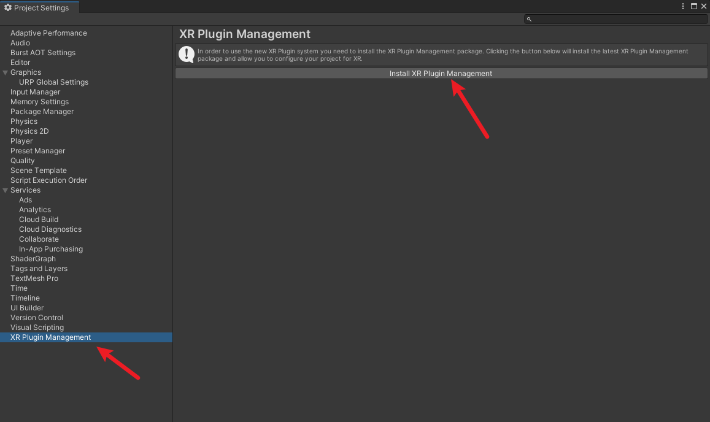
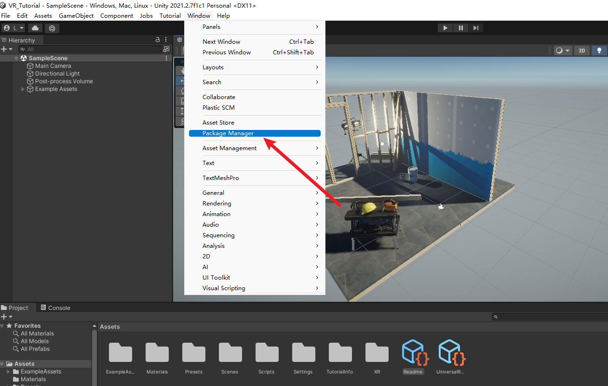

# 初入VR世界

电脑要求：Windows（必须是Windows系统）

演示VR眼镜：Oculus Quest 2

开发平台：Unity 2021.2.7、openXR

## Oculus配置

​	首先你的Oculus Quest2（以下简称Quest）需要激活成功，并打开开发者模式，这一步网上的教程很多，大家可以自行百度。

​	然后你还需要一根Link线，用于连接你的Quest和Windows。

​	下载Oculus app for PC: https://www.oculus.com/setup/

​	下载成功后，用link线连接上电脑，确保Oculus中能够添加上你的设备并显示已启用

​	并在Oculus中做一些通用的设置

​	接下来带上你的眼镜，打开Oculus Link Rift模式，稍等片刻，直到你进入一个白色的空间

​	以上操作完毕之后，你的Quest设备就已经成功连接到电脑上了，接下来就能愉快的开发unity项目了，并且在unity中点击运行之后，会直接运行到quest上，十分方便。

## Unity开发

我们来新建一个Unlversal Render Pipeline项目(也可以是3D项目，只不过这个里面有默认场景，会比较好看一点)

修改配置，使之成为一个VR项目

我们打开项目会发现有一些很大的图标，可以通过右上角的设置来缩小它

打开project setting安装XR Plugin Managerment

打开包管理器，启用预览包

打开Windows下的包管理器

切换到unity registry

找到OpenXR Plugin并安装

安装XR Interaction Toolkit

最好升级到2.X版本，亲测1.X版本会有bug，升级完之后导入Default Input Actions

再回到project setting中，在XR Plug-in Management中选择Oculus

进入default Input Actions文件夹，添加所有的预设

在project setting中选择preset Manager，设置一些控制器

在层级新建一个输入系统 => XR Origin

给XR Origin添加一个Input Action Manager组件

将XRI Default Input Actions添加到Input Action Manager的Action Assets中

选中XR Origin，将视野移到中间

接下来点击运行键，带上眼镜，就会发现你已经能够控制视野和手柄啦

视野似乎有点高，但是问题不大，下一节教程再见啦~